# Kappa Card — Architecture diagrams

Visual companion to [`ARCHITECTURE.md`](ARCHITECTURE.md). Each section below is an anchor target linked from the tech doc.

| Tech topic | This file |
|------------|-----------|
| System stack | [#system-stack](#system-stack) |
| Firestore overview | [#firestore-overview](#firestore-overview) |
| Collection paths | [#collection-paths](#collection-paths) |
| User profile (nested) | [#user-profile-nested](#user-profile-nested) |
| Invites & signup flow | [#invites-and-signup-flow](#invites-and-signup-flow) |
| Invite entity shapes | [#invite-entity-shapes](#invite-entity-shapes) |
| Public card & QR visit flow | [#public-card-and-qr-visit-flow](#public-card-and-qr-visit-flow) |
| Brothers upsert flow | [#brothers-upsert-flow](#brothers-upsert-flow) |
| Encounters vs analytics | [#encounters-vs-profile-analytics](#encounters-vs-profile-analytics) |
| Encounter entity | [#encounter-entity](#encounter-entity) |
| Payments & account deletion | [#payments-and-account-deletion](#payments-and-account-deletion) |
| Deferred connection requests | [#deferred-connection-requests](#deferred-connection-requests) |

Canonical TypeScript: [`src/types/index.ts`](src/types/index.ts). Rules: [`firestore.rules`](firestore.rules).

---

## System stack

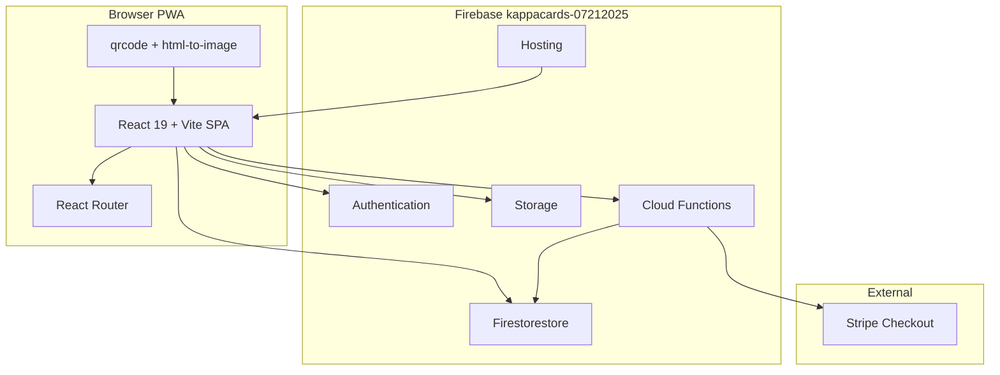

---

## Firestore overview

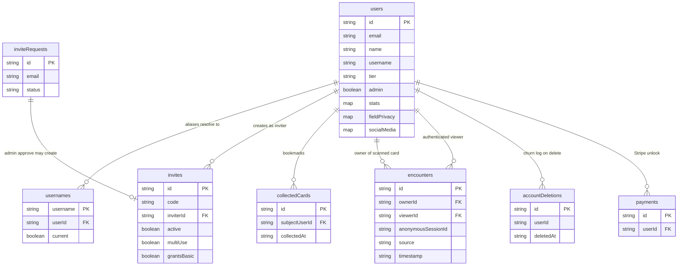

---

## Collection paths

| Path | Purpose |
|------|---------|
| `users/{uid}` | Member profile, tier, stats, privacy, inviter denorm |
| `users/{uid}/collectedCards/{subjectUid}` | Brothers list row (QR meet and/or saved contact + private notes) |
| `usernames/{slug}` | Public slug → uid (aliases for renames) |
| `invites/{id}` | One-time and multi-use invite codes |
| `inviteRequests/{id}` | Public “request an invite” inbox for admins |
| `encounters/{id}` | Anonymous QR claim pipeline (not the Brothers UI store) |
| `accountDeletions/{id}` | Churn analytics after account wipe |
| `payments/{sessionId}` | Stripe Checkout records (Admin SDK only) |

**Storage (not Firestore):** `profile-pictures/{uid}/profile.*`, `profile-pictures/{uid}/background.*`.

---

## User profile nested

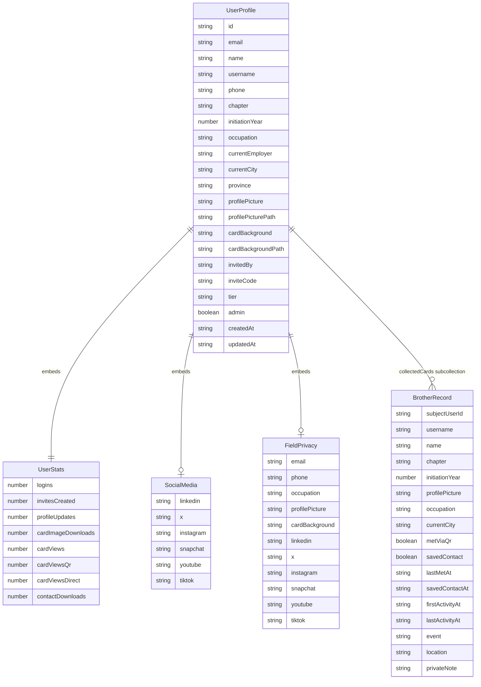

**Always public (not in `fieldPrivacy`):** name, username, chapter, initiation year, inviter accountability fields.

**Optional fields:** default `public` until flipped to `private`; `toPublicProfile()` strips private values for the public card and vCard.

---

## Invites and signup flow

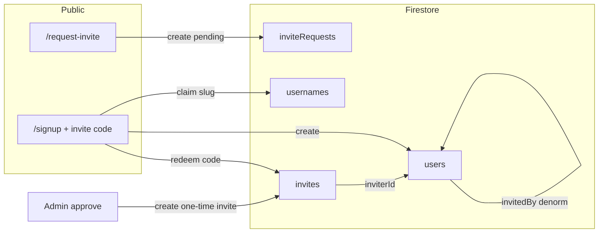

---

## Invite entity shapes

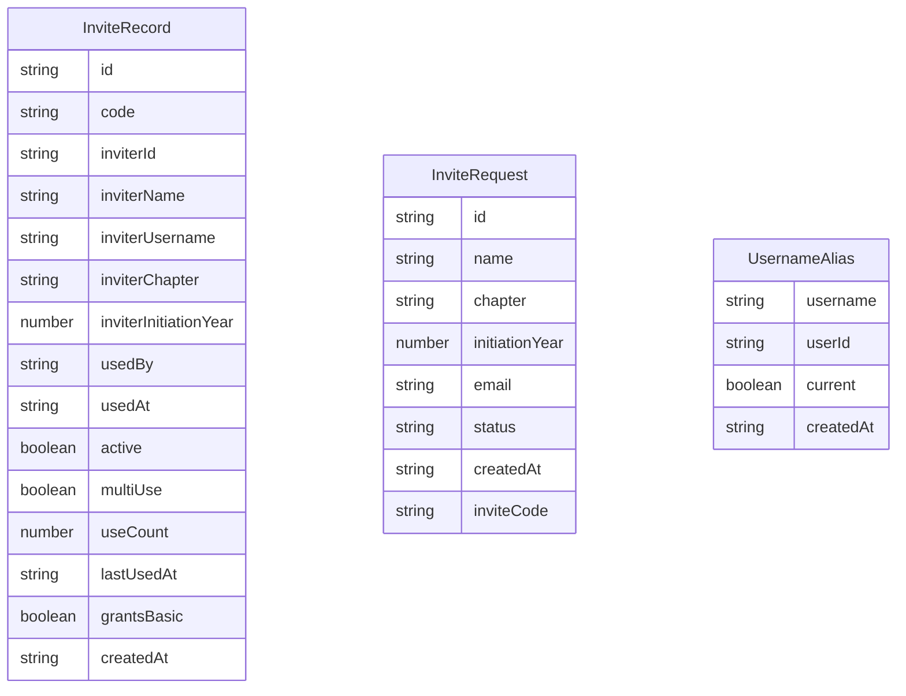

---

## Public card and QR visit flow

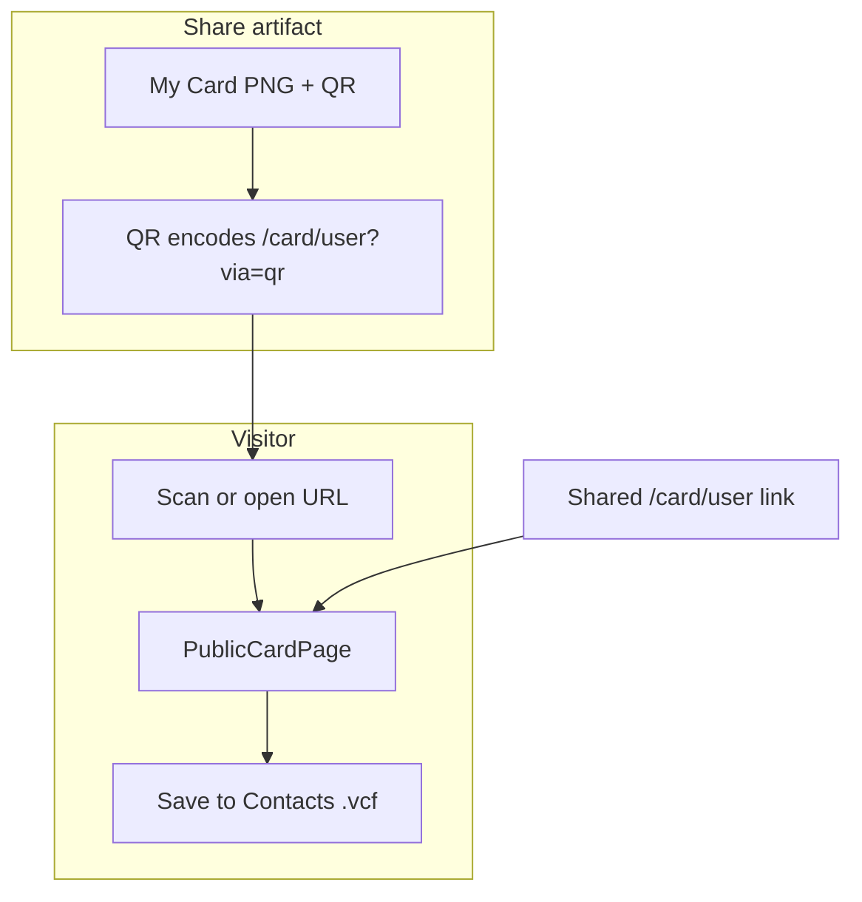

Normal shares and vCard profile URLs omit `?via=qr`. Only generated QR codes include the attribution query param.

---

## Brothers upsert flow

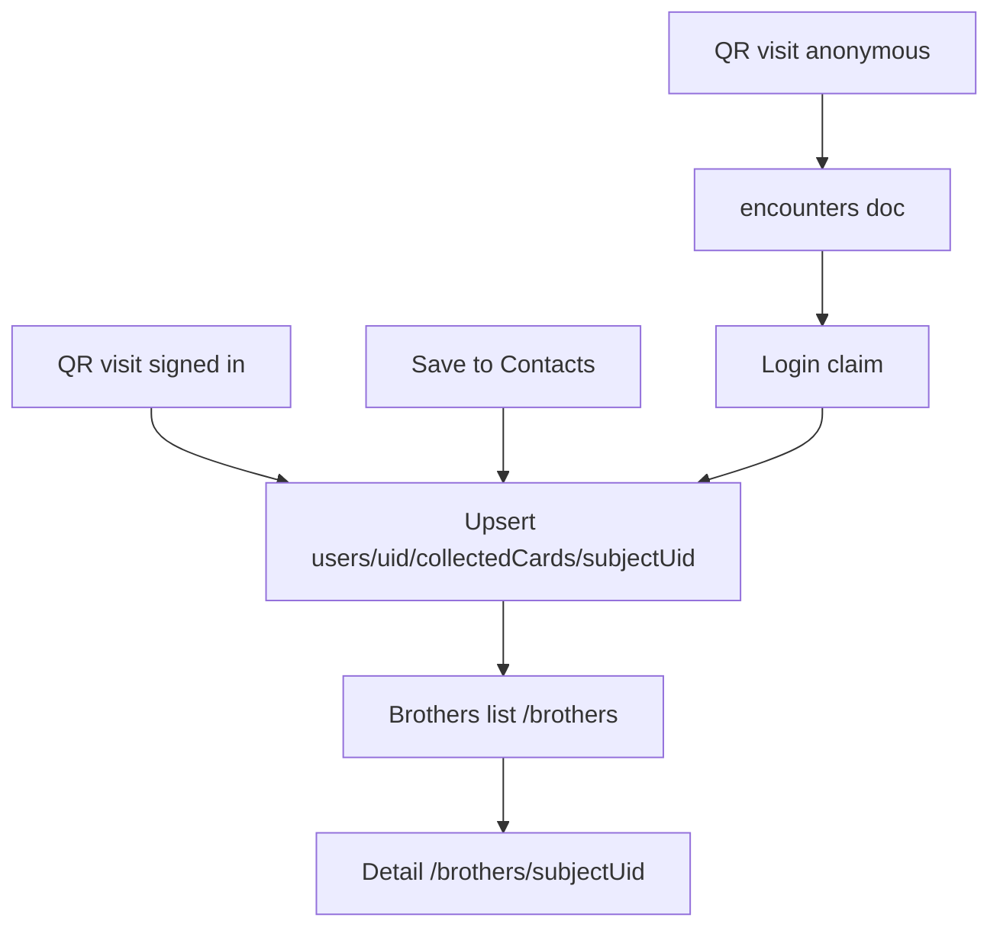

One row per brother. Badges: Met via QR and/or Saved contact. Notes live on the brother row.

---

## Encounters vs profile analytics

Encounters are **not** the same as profile views. Direct visits bump `users.stats.cardViews*`. QR visits (`?via=qr`) bump analytics **and** upsert Brothers (signed-in) or write an anonymous `encounters` doc for claim.

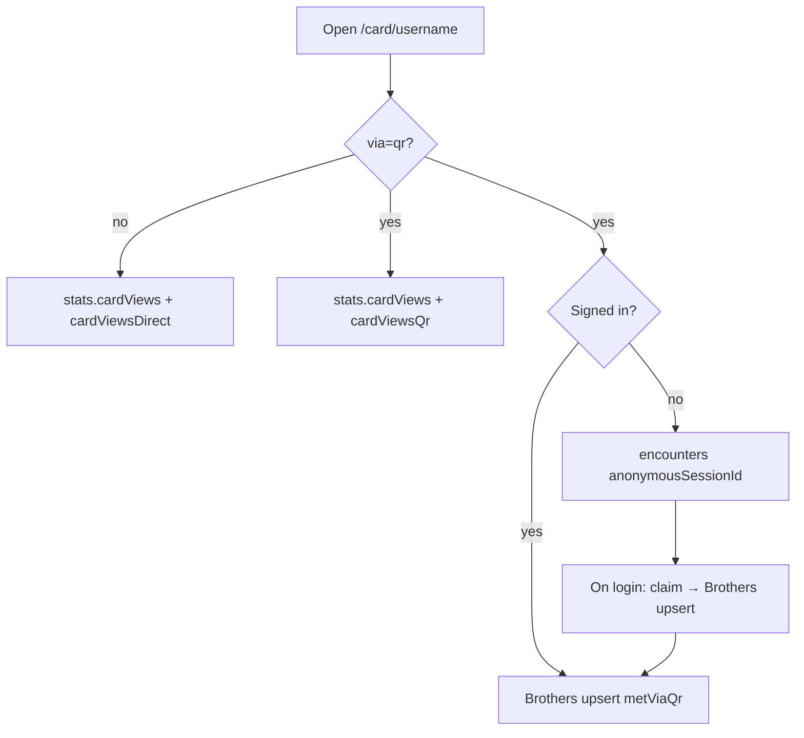

---

## Encounter entity

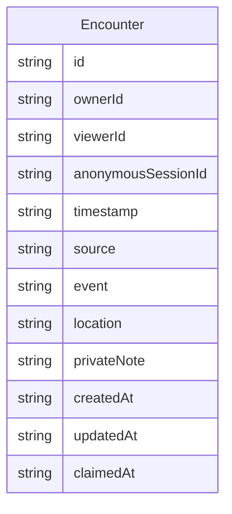

**Privacy:** Private notes for day-to-day use live on the **Brothers** row (`collectedCards`). Top-level `encounters` remain for anonymous QR → claim; owners still cannot client-read encounter docs in v1.

---

## Payments and account deletion

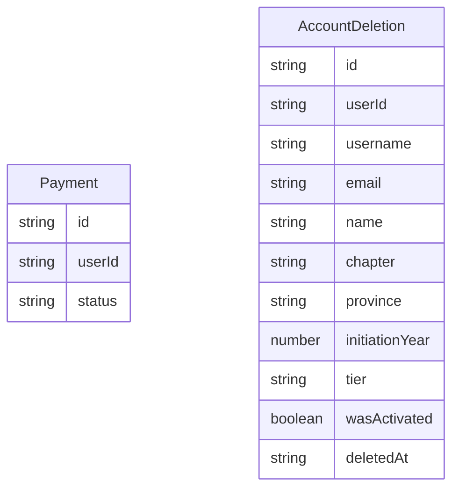

- `payments`: written only by Cloud Functions / Admin SDK; clients have no read/write.
- `accountDeletions`: member creates on wipe; admins read for churn analytics.

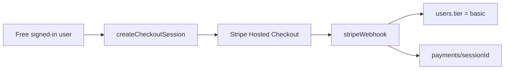

---

## Deferred connection requests

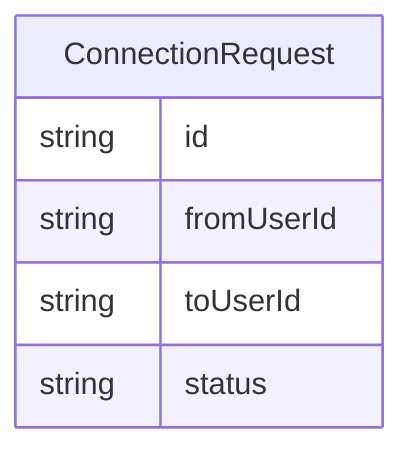

Types remain in code for a possible later return. Requests UI and Firestore rules for connection requests are not in the current product path.
